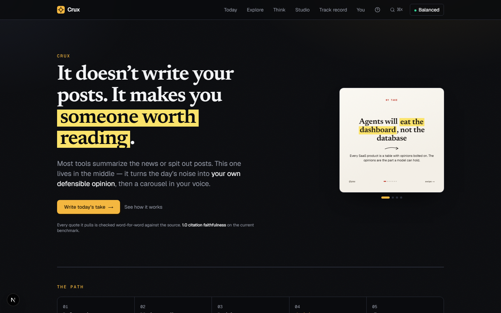

<div align="center">

# Crux

**It doesn't write your posts. It makes you someone worth reading.**

Turn a story or a raw thought into a defensible opinion — then a studio-grade social carousel in your voice.


[](https://github.com/codingwithiz/crux/actions/workflows/ci.yml)


[](https://vercel.com/new/clone?repository-url=https%3A%2F%2Fgithub.com%2Fcodingwithiz%2Fcrux&root-directory=web&project-name=crux&repository-name=crux&env=OPENAI_API_KEY,NEXT_PUBLIC_SUPABASE_URL,NEXT_PUBLIC_SUPABASE_ANON_KEY,SUPABASE_SERVICE_ROLE_KEY,CRON_SECRET&envDescription=An%20AI%20provider%20key%2C%20your%20Supabase%20project%2C%20and%20a%20random%20string%20for%20CRON_SECRET)



</div>

Most AI writing tools generate your opinion *for* you. That's slop. Crux is built on the opposite bet: the value isn't the content, it's the thinking behind it. The AI reads the source, argues with you, and designs the carousel — but it will not write the opinion, because the opinion is the only part that was ever yours.

> Information → Understanding → Insight → **Opinion** → Content.
> Everything else automates the first step and the last. The middle is the part worth protecting.

---

## What it actually does

**Break it down.** Paste a link or pick a story. Crux fetches the real page and tells you what happened, what's genuinely new versus repackaged, where the disagreement is, and the skeptic's best case — with **quotes checked word-for-word against the source**.

**Talk it through.** Optional. *Coach* helps you find a view; *Spar* attacks the one you have. Both refuse to hand you a conclusion.

**Save your take.** It lands in your track record with how sure you were. Score it later as reality weighs in, and you find out whether you're right *when you're confident*.

**Get the carousel.** Your take becomes a 1080×1350 deck in your voice — twelve editorial styles, ten narrative formats, ten visual modules — exported as PNGs, a ZIP, or a **LinkedIn-ready PDF**. If it isn't right, tell it what to change ("punchier", "less hype") or ask for two more versions.

| Explore | Track record | Studio |
| --- | --- | --- |
|  |  |  |

---

## Measured, not asserted

Crux ships an eval harness: a golden set of ten items — including three adversarial sources (one dense with numbers, one deliberately hedged, one pure marketing hype) — run through the **real** pipeline and scored by an LLM judge, plus one deterministic check that no model gets a say in.

Latest run ([`web/eval-history.json`](web/eval-history.json)):

| Metric | Score |
| --- | --- |
| **citationFaithfulness** (deterministic) | **1.00** |
| synthesis — grounding / clarity / neutrality | 3.5 / 4.3 / 4.2 |
| carousel — faithful / sharp / no-fabrication / quality | 4.5 / 4.2 / 4.7 / 4.1 |
| items scored | 10 / 10, 0 failures |

`citationFaithfulness` is the one to read. It takes every quote the synthesizer produced and checks by string match that it appears verbatim in the fetched source — no judge, no opinion. **1.00 means nothing was invented.** Judge scores wobble ±0.3 between identical runs, so treat small movements there as noise.

Run it yourself: the **Eval** workflow (manual dispatch — it spends real tokens) appends to `eval-history.json`, so quality is a trend rather than a claim.

---

## How it's built

```
paste a link ─┐
              ├─→ fetchReadable ─→ SYNTHESIZE ─→ verify citations ─┐
pick a story ─┤    (SSRF-guarded)   (grounded)   (substring, deterministic)
              │                                                     │
raw thought ──┘                                                     ▼
                                        ┌── understand it → neutral explainer deck
        [ you read it ] ────────────────┼── your take → Coach/Spar → SAVE ──→ carousel
                                        └── save for later (no opinion required)
```

Every arrow is a human click. There is no server-side workflow engine and that is deliberate: the pauses *are* the product. Notes on that and the other rejected designs live in [`ARCHITECTURE.md`](ARCHITECTURE.md).

**Things worth a look if you're reading the code:**

- **`lib/citations.ts`** — anti-fabrication as code, not a prompt. Quotes are matched against the source text with punctuation-tolerant normalization; unmatched ones are shipped to the UI marked *unverified* rather than quietly dropped. When there's no source at all, citations are dropped entirely — models will happily invent quote-shaped text with plausible URLs.
- **`lib/ai/generate.ts`** — one choke point for every structured call: an error taxonomy (a 401 fails in a second instead of burning three retries on a "return valid JSON" plea), jittered backoff that honours `retry-after`, a 45s timeout, and token/cost recording.
- **`lib/ai/server-settings.ts`** — the client sends a *tier* (`speed` / `balanced` / `deep`), never a provider or model. The server picks from what it can actually reach, which makes "choose a provider you have no key for" unrepresentable.
- **`lib/rank.ts`** — feed ranking that can explain itself, keeping topics you chose separate from words you happened to write.
- **`components/carousel/SlideCanvas.tsx`** — the renderer. The preview *is* the export: real HTML/CSS rasterized client-side, so what you see is the pixel-exact PNG.

### Cost observability

Every model call records tokens, price, latency, attempts and an error code. Three queries answer most of what you'd want to know:

```sql
-- What did today cost, by pipeline step?
select label, round(sum(cost_usd)::numeric, 4) as usd, count(*) as calls
from ai_calls where created_at > now() - interval '1 day'
group by label order by usd desc;

-- Which steps are slow, and how often do they need a retry?
select label, round(avg(latency_ms)) as ms, round(avg(attempts), 2) as tries
from ai_calls where ok group by label order by ms desc;

-- What's failing, and why?
select error_code, count(*) from ai_calls where not ok group by error_code;
```

---

## Getting started

```bash
cd web
npm install
npm run dev          # http://localhost:3000
```

The app lives in [`web/`](web) (Next.js 16 App Router). With Supabase configured it is **login-only**; without it, it runs single-user out of this browser's local storage, which is the supported way to try it locally.

### Environment (`web/.env.local`)

```bash
# AI provider — any one works. Server-side only; there is no bring-your-own-key.
OPENAI_API_KEY=...
# GOOGLE_GENERATIVE_AI_API_KEY=...
# ANTHROPIC_API_KEY=...

# Accounts + cloud sync. Omit all three to run single-user locally.
NEXT_PUBLIC_SUPABASE_URL=...
NEXT_PUBLIC_SUPABASE_ANON_KEY=...
SUPABASE_SERVICE_ROLE_KEY=...   # the daily feed scan writes with this

# Required in production: the cron route fails closed without it.
CRON_SECRET=...

# Eval judge override (optional)
# JUDGE_PROVIDER=google
# JUDGE_MODEL=gemini-2.5-pro
```

Apply the migrations in [`web/supabase/migrations/`](web/supabase/migrations) **in order** — see [`web/SUPABASE.md`](web/SUPABASE.md). They are not optional: several fix real data-exposure bugs.

### Commands

```bash
npm run dev        # dev server
npm run build      # production build
npm run typecheck  # tsc --noEmit (includes the tests)
npm run lint       # eslint
npm run test:e2e   # Playwright: unit specs, then browser specs
```

CI runs typecheck, lint and the full suite with **no Supabase env and `MOCK_LLM=1`** — deterministic, free, and no secrets required, so a fork's CI passes on the first push.

---

## Tech

**Next.js 16** (App Router, React 19) · **TypeScript** · **Tailwind v4** · **AI SDK v6** (OpenAI / Google / Anthropic / Ollama) · **Supabase** (Postgres, Auth, RLS, pgvector, Storage) · **Zod** structured outputs · **modern-screenshot** (client PNG) · **jsPDF** (LinkedIn PDFs) · **JSZip** · **cmdk** · **lucide-react** · **sonner**

Feed sources are dependency-free: HN, Hugging Face papers, GitHub, Reddit, Lobsters, arXiv, and ~17 RSS feeds, parsed with regex rather than a library.

```
web/
  app/            # today · explore · think · studio · gallery · ledger · voice · login + /api/*
  components/     # ConvictionFlow, CarouselStudio, LedgerView, BrowseView, TodayView, …
    carousel/     # SlideCanvas (the renderer) + decor primitives
    ui/           # Button, Card, Callout, Field, Dialog, Ink (marker/underline/rules)
  lib/
    ai/           # model routing, prompts, generateStructured, cost, server-settings
    carousel/     # 12 designs, 10 formats, 10 modules, brand resolution, export, pdf
    rank.ts · citations.ts · ledger.ts · voice.ts · sources.ts · supabase/
  supabase/migrations/   # 0001–0013, applied in order by hand
  tests/          # Playwright: unit specs + browser specs + the docs capture rig
```

---

## License

MIT — see [`LICENSE`](LICENSE).

*The principle, throughout: the AI scaffolds and expresses; the human forms the view and owns it.*
