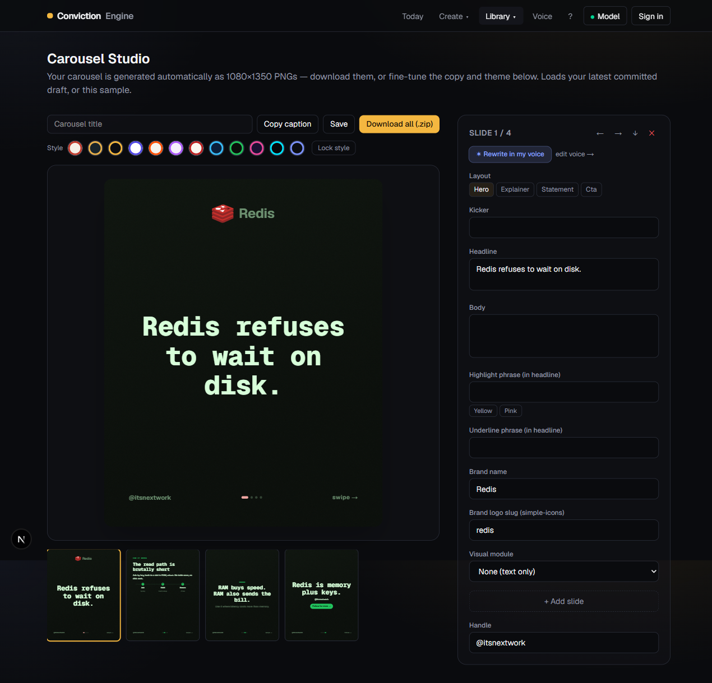
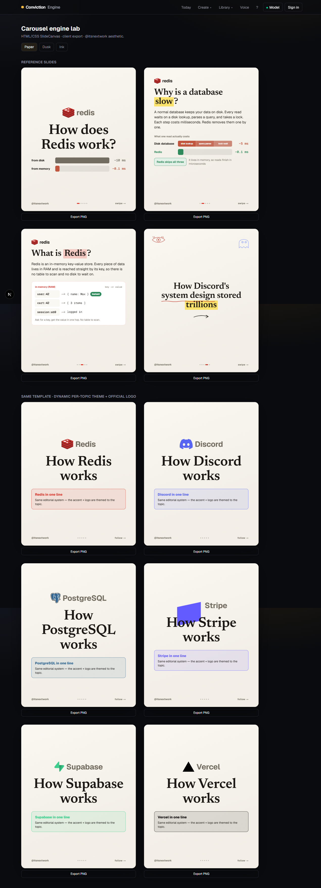
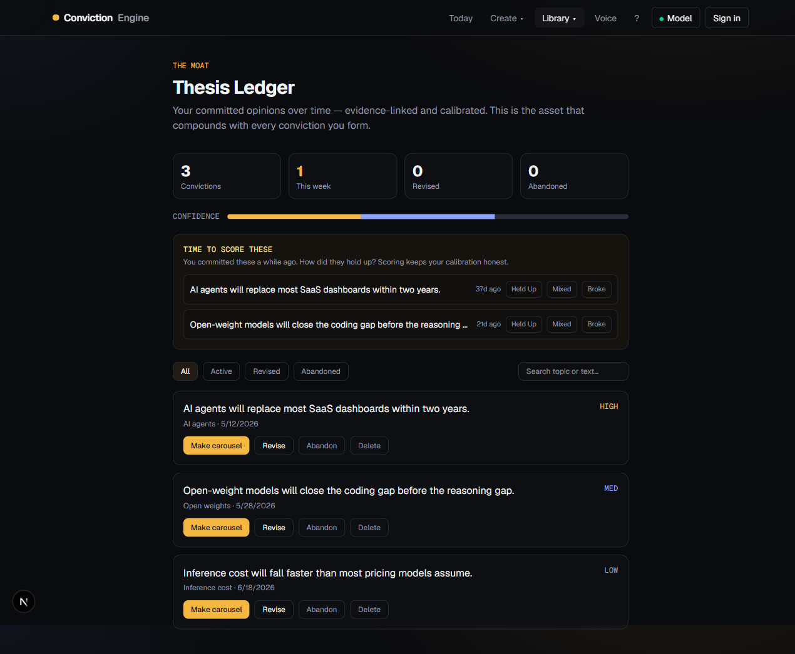
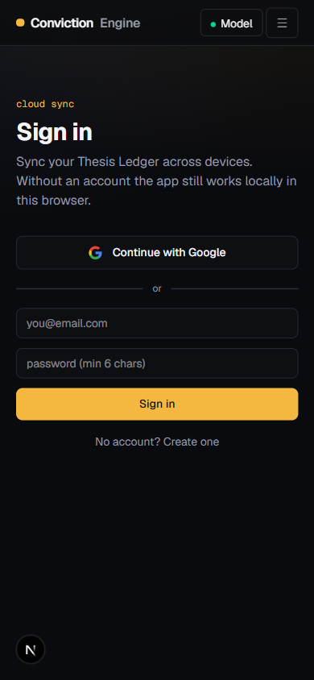

# Agentic Conviction Content Engine

**Turn AI news — or a raw thought — into a *defensible* opinion, then a world‑class social carousel that sounds like you.**

Most AI writing tools generate your opinion *for* you. That's slop. This one is built on the opposite bet: the value isn't the content, it's the **conviction** behind it. The AI is a thinking partner that *sharpens your view* and never writes it for you — then expresses your committed take as a studio‑grade carousel.

> Information → Understanding → **Conviction** → Content.
> Everyone automates the first and last steps. The defensible wedge is the middle — so that's what this engine protects.

---

## 📸 Screenshots

**The Studio** — live preview, 12 styles, undo, LLM‑backed module editing, one‑click PNG/ZIP export:



**Dynamic per‑topic theming** — one editorial system, a different brand color world + **official logo** for each topic:



**The Thesis Ledger** — calibration scoring + re‑surfacing ("time to score these") · **Mobile‑first + Google sign‑in**:

| Ledger | Mobile |
| --- | --- |
|  |  |

> The dev‑only `/lab` route renders every style and module for quick visual review.

---

## ✨ What makes it different

### 🧠 A thinking pipeline, not a content generator
A 6‑agent, human‑in‑the‑loop flow where **you** own the opinion:

`Input → Synthesize → Discuss → Commit → Carousel`

- **Synthesizer** — reads the real source (NotebookLM‑style, source‑grounded) and breaks it down in plain English: what happened, what's genuinely new vs. repackaged, the key debate, the skeptic's case, and the questions you must answer first. Returns **verbatim citations** so claims are receipted, not hallucinated.
- **Coach / Spar (the Adversary, reimagined)** — *optional and adaptive*. **Coach** mode is supportive: it reflects what's good in your take and offers angles to help you *find* a view. **Spar** mode is a hard adversary that escalates and pressure‑tests you. Either way it **refuses to write your conclusion** — and it's forced to be **concrete and specific**, never vague.
- **Compile‑to‑commit** — when you're done talking it through, it compiles *your own* argued points into a draft thesis you can commit in one click.
- **Expressor** — turns your committed thesis into a carousel: it picks a narrative *format* and a *visual style* that fit the topic, chooses a concrete visual module per slide, detects the brand, and writes it in your voice — grounded in the synthesis, **never inventing numbers**.

### 🎨 A world‑class carousel engine
- **Real HTML/CSS rendering, exported client‑side** (`modern-screenshot`) — the on‑screen preview *is* the exported 1080×1350 PNG. Full CSS: blur, shadows, real fonts, gradients. No server render cost.
- **Topic‑aligned dynamic theming** — the LLM detects the subject brand (Redis, OpenAI, Stripe, Discord…) and the carousel renders its **official full‑color logo** + a color world derived from the **official brand hex**. Curated logos in‑app + a CDN fallback for the long tail.
- **A 10‑module visualization library** the LLM fills per slide: stat bars, bar chart, line/trend chart, donut, big stat, timeline, icon flow, comparison, key→value, and callout — all real SVG/CSS, all export‑faithful.
- **10 narrative formats** (explainer, myth‑vs‑reality, "N levels", before/after, hidden‑cost, contrarian, listicle, timeline, case study, conviction arc) so every topic doesn't tell the same story.
- **12 cohesive design styles** (editorial paper, clean product, brutalist, pastel, magazine, dusk, ink, slate, blueprint, terminal, aurora mesh, neon night) — each with its own serif/sans/mono type personality. The LLM picks one per topic; a **brand‑lock** toggle pins one look for a consistent page.
- **Distinct slide layouts** — hero cover, content explainer, bold statement, closing CTA — that actually look different.

### 🛠️ A real editing Studio
- **Undo** for structural edits, a live preview, a 12‑style picker + brand‑lock, **revoice the whole deck**, copy‑caption, and **one‑click PNG / ZIP export**.
- **LLM‑backed module switching** — switch a slide's visual module and it regenerates *meaningful, slide‑specific data* (real keys/labels, not "point 1") from that slide's content, with an instant heuristic fallback.

### 🗣️ Your voice, as a signature
- Distill your real posts into a reusable style guide, or start from **voice presets** (Punchy operator · Calm analyst · Playful builder · Clear academic). Your voice steers the copy *and* nudges the format/style picks — so the output is recognizably yours, not generic AI.

### 📒 The Thesis Ledger — a compounding moat
- Every committed opinion is saved, searchable, and revisable. **Calibration scoring** keeps score: were you right *when you were confident?* And **re‑surfacing** nudges you to score older convictions ("Time to score these"), closing the loop so you actually learn.

### ⚙️ Built like a product, not a demo
- **Durable AI workflow** — a `generateStructured` wrapper adds retries, **schema‑repair** (re‑asks the model when its JSON fails validation), provider fallback, and latency logging across every structured call.
- **An eval / benchmark harness** (`POST /api/eval`, dev‑only) — runs a golden set through the *real* pipeline and scores it with an LLM‑as‑judge on grounding, sharpness, no‑fabrication, and quality, plus a **deterministic citation‑faithfulness** check. Quality is a tracked number, not a vibe.
- **Mobile‑first** responsive UI and **Google OAuth** (Supabase) with local→cloud migration on first sign‑in. Works fully offline in `localStorage` mode with no account.

---

## 🧩 The flow

```
        ┌──────────┐   ┌────────────┐   ┌──────────────┐   ┌──────────┐   ┌──────────────┐
 news / │  INPUT   │ → │ SYNTHESIZE │ → │   DISCUSS    │ → │  COMMIT  │ → │   CAROUSEL   │
 thought│ your take│   │ grounded + │   │ Coach / Spar │   │ compile  │   │ format +     │
        │          │   │ citations  │   │  (optional)  │   │ your take│   │ style + voice│
        └──────────┘   └────────────┘   └──────────────┘   └──────────┘   └──────────────┘
                                  the human owns "form view" + "commit"
```

---

## 🚀 Getting started

```bash
cd web
npm install
npm run dev          # http://localhost:3000
```

The app lives in [`web/`](web) (Next.js 16 App Router). It runs out of the box in **localStorage mode** with no account. Add keys to enable cloud sync + live models.

### Environment (`web/.env.local`)

```bash
# AI providers (any one works; OpenAI is the default server key)
OPENAI_API_KEY=...
GOOGLE_GENERATIVE_AI_API_KEY=...
# ANTHROPIC_API_KEY=...        # optional (BYOK)

# Cloud sync + auth (optional — app works locally without these)
NEXT_PUBLIC_SUPABASE_URL=...
NEXT_PUBLIC_SUPABASE_ANON_KEY=...
SUPABASE_SERVICE_ROLE_KEY=...  # for the daily radar cron only

# Eval judge override (optional)
# JUDGE_PROVIDER=google
# JUDGE_MODEL=gemini-2.5-pro
```

> `.env.local` is gitignored. For Google sign‑in, enable the Google provider in your Supabase dashboard and add `…/auth/callback` to the allowed redirect URLs. See [`web/SUPABASE.md`](web/SUPABASE.md) for the cloud setup.

### Useful commands

```bash
npm run dev        # dev server
npm run build      # production build
npm run lint       # eslint
npm run test:e2e   # Playwright tests
```

Run the benchmark (with the dev server running): `POST http://localhost:3000/api/eval`.

---

## 🏗️ Tech stack

- **Next.js 16** (App Router, React 19) · **TypeScript** · **Tailwind v4**
- **AI SDK v6** (`ai`) with OpenAI / Google / Anthropic / Ollama providers
- **Supabase** (Postgres + Auth + RLS) with a `localStorage` fallback
- **modern-screenshot** (client PNG export) · **simple-icons** + curated logos · **Framer Motion**
- **Zod** structured outputs · **JSZip** carousel export

## 📁 Structure (high level)

```
web/
  app/            # routes (today, news, think, studio, gallery, ledger, voice, login) + /api/*
  components/     # ConvictionFlow, CarouselStudio, LedgerView, VoiceEditor, Nav, …
    carousel/     # SlideCanvas (HTML/CSS renderer) + decor primitives
  lib/
    ai/           # model router, prompts, generateStructured (durable), step routing
    carousel/     # design system (12 styles), formats (10), modules, brand resolution, llm schema, export
    ledger.ts · carousels.ts · voice.ts · settings.ts · supabase/
```

---

## 📌 Status

Built and verified across phases: backend fixes → world‑class carousel engine + visualization library → mobile + Google auth → durable AI + eval harness → friendlier flow, creative variety, voice, and ledger calibration. The dev‑only `/lab` route showcases the rendering engine and every style.

*Anti‑slop principle, always: the AI scaffolds and expresses; the human forms the view and owns the commit.*
